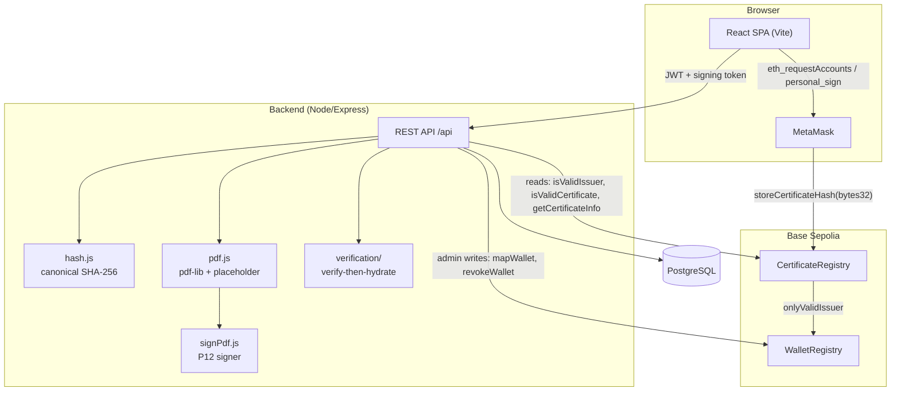
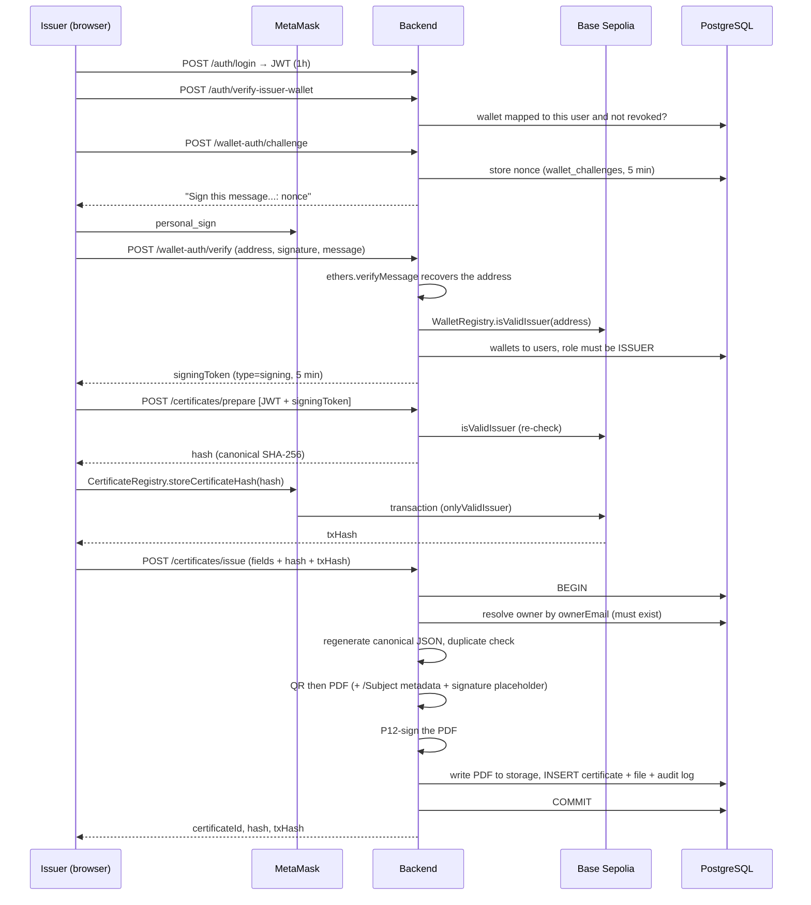
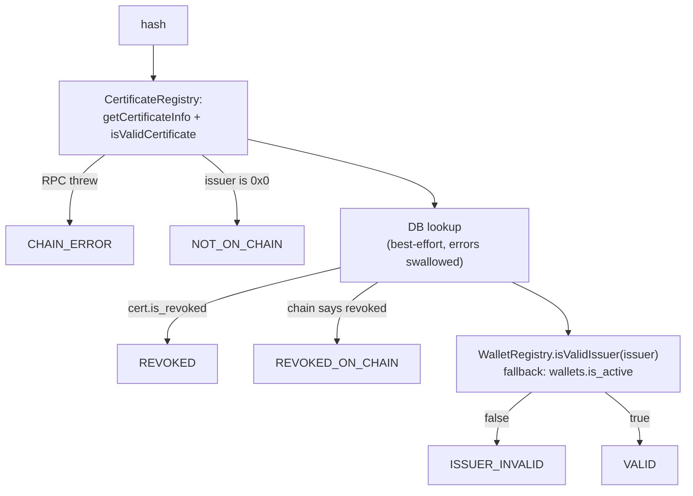
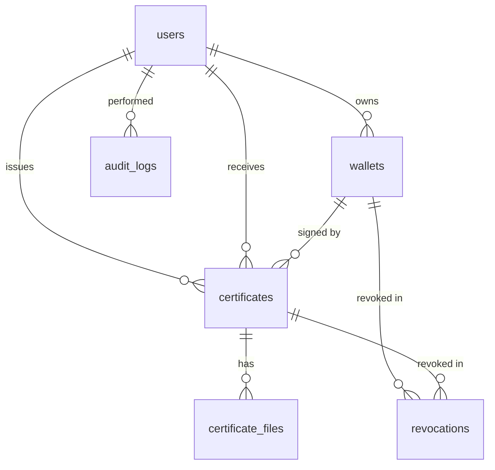

# CERTIFY — Architecture

A deep technical description of how CERTIFY issues, anchors, signs, and verifies
credentials. Read this before changing anything in the hashing, signing, or
verification paths — those three are load-bearing and coupled.

- **Overview & setup** → [README.md](README.md)
- **API reference** → [backend/API.md](backend/API.md)
- **Deployment** → [deployment_instructions.md](deployment_instructions.md)
- **Secrets handling** → [SECURITY.md](SECURITY.md)

---

## 1. Trust model

CERTIFY does not ask a verifier to trust the CERTIFY server. It asks them to
trust two independent facts:

| Layer | Question it answers | Where the truth lives |
| :--- | :--- | :--- |
| **On-chain anchor** | *Did an authorized institution commit to exactly this credential content?* | `CertificateRegistry` on Base Sepolia |
| **PDF digital signature** | *Was this PDF produced by the CERTIFY platform and not modified since?* | PKCS#7 signature embedded in the PDF |
| **Database** | *What are the human-readable details?* | PostgreSQL — **enrichment only, never authority** |

The database can be wiped, corrupted, or unreachable and a certificate still
verifies. That property is enforced by the verification path (§6): the chain is
queried first, and the DB read is wrapped in a `.catch()` that degrades to an
empty result rather than failing.

Issuers are **non-custodial**. The certificate hash is written to the chain by
the issuer's own MetaMask wallet, not by a server key. The server never holds
issuer private keys.

---

## 2. Topology



Two wallets act on chain, and they are different:

- **Server admin signer** (`DEPLOYER_PRIVATE_KEY`) — only ever calls
  `WalletRegistry.mapWallet` / `revokeWallet`. Loaded in
  `backend/src/config/blockchain.js`.
- **Issuer wallet** (MetaMask, in the browser) — only ever calls
  `CertificateRegistry.storeCertificateHash`. The server has no key for it.

---

## 3. Roles

Roles live in `users.role` and are enforced by `roleMiddleware.js`.

| Role | Obtained by | Can do |
| :--- | :--- | :--- |
| `ADMIN` | Seeded via `backend/scripts/reset-db.js` | Create issuer accounts, map/revoke issuer wallets, download any certificate |
| `ISSUER` | Created by an admin (`POST /api/admin/create-issuer`) | Prepare + issue certificates (requires a live wallet signature), list own issuances |
| `OWNER` | Student self-registration via email OTP | List own certificates, download own PDFs |
| `VERIFIER` | *No account needed* | All `/api/verify/*` endpoints are public and unauthenticated |

`VERIFIER` exists in the `users.role` CHECK constraint and in the frontend role
table, but verification requires no login — `/verify` is an open route.

---

## 4. The canonical hash

`backend/src/modules/certificates/hash.js` is the centre of the system. Every
other component derives from it.

### Inputs — exactly eight fields

```js
{ ownerName, courseName, department,
  issueMonth, issueYear, graduationMonth, graduationYear,
  issuerWallet }
```

Everything else about a certificate — email, certificate number, issuance
timestamp, PDF bytes — is **outside** the hash and cannot affect it.

### Algorithm

1. `buildCertificateData()` picks the eight fields and coerces each to a
   `String` (missing → `''`). This is what makes `2025` and `"2025"` agree.
2. `canonicalizeJSON()` sorts keys alphabetically, recursively.
3. `JSON.stringify()` on the sorted object — no whitespace, stable ordering.
4. `SHA-256` → 64-char lowercase hex.

Sorted key order is therefore always:

```
courseName, department, graduationMonth, graduationYear,
issueMonth, issueYear, issuerWallet, ownerName
```

### Why determinism matters

The same canonical JSON is embedded in the PDF's `/Subject` metadata field at
generation time. A verifier can extract it from any copy of the PDF, re-run
steps 2–4, and arrive at the same 64 hex characters that were anchored on
chain — without the server, without the database, and without trusting either.

It is also why `GET /certificates/:id/download` can regenerate a lost PDF from
database columns and still produce a verifiable document (§7).

### Consequence: the hash is a content identity, not a document identity

Two certificates with identical values across all eight fields produce an
identical hash. Both the contract (`certificate hash already exists`) and the
service (`Duplicate certificate hash`) reject the second one. Re-issuing the
same course to the same student from the same wallet in the same month is
therefore impossible by construction — vary a field or it will be refused.

---

## 5. Issuance pipeline



### Why `prepare` and `issue` are separate

The chain write happens **between** them, in the browser. `prepare` computes
the hash the issuer is about to commit to; `issue` records what was actually
committed. Splitting them is what keeps the private key in MetaMask.

The cost is that `issue` accepts a client-supplied `txHash` and does not
re-read it from the chain. A fabricated `txHash` produces a database row, but
verification still queries `CertificateRegistry` directly, so such a row simply
verifies as `NOT_ON_CHAIN`. The chain, not the row, decides.

### Three token types

| Token | Lifetime | Storage | Transport | Purpose |
| :--- | :--- | :--- | :--- | :--- |
| Access JWT | `JWT_EXPIRES_IN` (default `1h`) | `localStorage` | `Authorization: Bearer` | Identity + role |
| Signing token | 5 min, `type: 'signing'` | `sessionStorage` | `Issuer-Signature-Token` header | Proves a *live* wallet signature |
| Challenge nonce | 5 min | `wallet_challenges` table | request body | Replay protection for the signature |

`requireIssuerSignature.js` re-validates on every use: token type, role, that
`decoded.userId` matches the authenticated `req.user.id`, and that the wallet is
still mapped and un-revoked in the database. The nonce row is deleted on
successful verification, so a signature cannot be replayed.

Both headers are attached automatically by the axios interceptors in
`frontend/src/api/client.js`.

---

## 6. Verification pipeline — "verify-then-hydrate"

`backend/src/modules/verification/service.js`.

### `verifySingleCertificate(hash)`



The order is the point. The chain is consulted before the database enters the
picture at all, and the DB query is wrapped so that a database outage downgrades
the response from "valid with full details" to "valid with issuer address and
timestamp only" — never to a failure.

Statuses returned: `VALID`, `NOT_ON_CHAIN`, `REVOKED`, `REVOKED_ON_CHAIN`,
`ISSUER_INVALID`, `CHAIN_ERROR`, plus `ERROR` (per item in bulk) and `INVALID`
(upload with no recoverable metadata).

### `verifyFileStateless(pdfBuffer)` — the upload path

Two branches, tried in order:

1. **Binary hash.** Verify the PKCS#7 signature; if valid, `sha256` the *entire
   PDF buffer* and look that up on chain. If found, return.
2. **Canonical-JSON hash.** Read `/Subject` from the PDF, re-run
   `generateCertificateHash()`, look that hash up on chain.

Branch 1 currently never matches for certificates issued by this codebase —
issuance anchors the canonical-JSON hash (§5), not the PDF's byte hash. It is a
compatibility branch kept for PDFs whose raw bytes were anchored. Branch 2 is
the live path. Removing branch 1 would change nothing today; leave it unless you
are deliberately retiring byte-hash support.

When the chain says valid but the database has no row, the extracted canonical
fields are attached to the response as `certificateData`, so the verifier still
sees a name and a course.

---

## 7. PDF signature layer

### Signing (`pdf.js` → `signPdf.js`)

1. `pdf-lib` draws the landscape-A4 certificate and embeds the QR PNG.
2. `pdfDoc.setSubject(canonicalJSON)` hides the canonical JSON in metadata.
3. `pdflibAddPlaceholder()` reserves the signature dictionary.
4. `pdfDoc.save({ useObjectStreams: false })` — **required**; object streams
   would relocate the placeholder and break `ByteRange` computation.
5. `signPdfBuffer()` decodes `P12_BASE64` (cached in module scope after the
   first call), builds a `P12Signer` with `P12_PASSWORD`, and signs.

The P12 lives in an environment variable, not on disk — a deliberate change so
the platform runs on ephemeral filesystems (Render, containers). Generate a
self-signed one for development with `backend/generate-cert.js`.

### Verifying (`verification/verifySignature.js`)

Hand-rolled PKCS#7 verification over `node-forge`, because the PDF signature
must be checked server-side without a PDF reader:

1. Parse `/ByteRange [a b c d]` and concatenate the two signed spans.
2. Extract the hex signature between them; strip zero padding.
3. `forge.asn1.fromDer` → walk `ContentInfo → [0] → SignedData → SignerInfos[0]`.
4. Compare the `messageDigest` authenticated attribute (OID
   `1.2.840.113549.1.9.4`) against `sha256(signedData)` — this is the tamper
   check.
5. Re-tag the authenticated attributes from `[0] IMPLICIT` to `SET` (UNIVERSAL
   17) as PKCS#7 requires, DER-encode, and RSA-verify against the signer
   certificate's public key.
6. Check the signing certificate's validity window.

`backend/test-signing.js` exercises the full round trip, including a deliberate
tamper that must be reported invalid.

### Download and regeneration

`GET /certificates/:id/download` reads the stored PDF from
`backend/storage/certificates/`. If the file is gone — the normal case on an
ephemeral host — the controller **regenerates** it from `certificates` plus
`additional_info`, reusing the canonical JSON so the on-chain hash still matches.

Note that the regenerated PDF carries an empty signature placeholder: the
regeneration path does not call `signPdfBuffer()`. It verifies through the
canonical-JSON branch (§6, branch 2) but will not pass a PKCS#7 signature check.
If offline signature validity matters for re-downloads, sign in that path too,
or move storage to a durable bucket.

---

## 8. Data model

`backend/schema.sql`. Eight tables.



| Table | Role |
| :--- | :--- |
| `users` | Accounts. `role ∈ {ADMIN, ISSUER, OWNER, VERIFIER}`, `status ∈ {ACTIVE, INACTIVE, SUSPENDED, REVOKED}`. Email is a case-insensitive identity: stored lowercase, read via `LOWER(email)`, and unique on `LOWER(email)` |
| `wallets` | Issuer wallet ↔ user mapping; `mapped_tx_hash`, `revoked_at`, `revoked_tx_hash` |
| `certificates` | One row per issued credential; `certificate_hash` is UNIQUE; the newer fields live in `additional_info` JSONB |
| `certificate_files` | PDF/QR file references; `file_path` stores a **bare filename**, resolved against the storage directory |
| `audit_logs` | Append-only trail: `WALLET_MAPPED`, `WALLET_REVOKED`, `WALLET_SIGNATURE_VERIFIED`, `CERTIFICATE_ISSUED`, `ISSUER_CREATED`, `STUDENT_REGISTERED` |
| `revocations` | Structured revocation records for wallets and certificates |
| `wallet_challenges` | Nonce per wallet address, 5-minute TTL, deleted on use |
| `student_otp` | 6-digit OTP per email, 10-minute TTL, upserted on re-request |

Schema notes worth knowing before you touch it:

- `certificates.nonce` is a leftover from the pre-deterministic design. It is
  written as the all-zero UUID and is no longer part of the hash.
- Institution metadata (`contactPhone`, `website`, …) from
  `POST /api/admin/create-issuer` is stored **only** in the `ISSUER_CREATED`
  audit log's `metadata` JSONB — there is no institutions table.
- Row Level Security is enabled on `certificates`, with policies keyed on
  `current_setting('app.current_user_id')`, but the application never sets that
  GUC. Access control is enforced in application code (`getCertificateById`
  throws `Access denied` for non-owner, non-admin). Treat the RLS policies as
  inert.
- `wallets.is_active` is never flipped to `false` on revocation — only
  `revoked_at` is set. Everything in the request path filters on
  `revoked_at IS NULL`, so behaviour is correct, but the chain-failure fallback
  in verification reads `is_active` and will read stale-optimistic.

---

## 9. Smart contracts

Solidity 0.8.20, optimizer on (200 runs), deployed to Base Sepolia (chain ID
`84532`). Addresses live in `contracts/deployed-addresses.json`.

### `WalletRegistry.sol`

Admin-only issuer allowlist. `mapWallet` / `revokeWallet` flip
`validIssuer[address]` and stamp `mappedAt` / `revokedAt`. `transferAdmin`
moves the admin role. `isValidIssuer(address) → bool` is the single read the
rest of the system depends on.

### `CertificateRegistry.sol`

Holds `mapping(bytes32 => CertInfo{issuer, issuedAt, revoked, revokedAt})`.

- `storeCertificateHash(bytes32)` — `onlyValidIssuer`; rejects the zero hash and
  duplicates. Records `msg.sender` as the issuer.
- `revokeCertificate(bytes32)` — `onlyAdmin`.
- `isValidCertificate(bytes32)` — true only if the certificate exists, is not
  revoked, **and its issuer is still valid in `WalletRegistry`**. This last
  clause is the mechanism by which revoking an institution's wallet invalidates
  every credential it ever issued, in a single transaction.
- `getCertificateInfo(bytes32)` — raw tuple for the verification path.

Certificate revocation is implemented on chain and modelled in the database, but
**no API route exposes it**. `revokeCertificateOnChain()` exists in
`backend/src/config/blockchain.js` and is unreferenced; revoking one credential
today means calling the contract directly (Hardhat console or a block explorer).
Wallet-level revocation *is* wired up (`POST /api/wallets/revoke`) and cascades
to every certificate via the clause above.

---

## 10. Configuration

`backend/src/config/env.js` hard-fails at boot if any of `DATABASE_URL`,
`JWT_SECRET`, `RPC_URL`, `CONTRACT_WALLET_REGISTRY`, or
`CONTRACT_CERT_REGISTRY` is missing, or if `JWT_SECRET` is shorter than 32
characters.

| Variable | Consumer | Notes |
| :--- | :--- | :--- |
| `DATABASE_URL` | `db/pool.js` | SSL with `rejectUnauthorized: false` when `NODE_ENV=production` |
| `JWT_SECRET` | auth + signing tokens | ≥ 32 chars, enforced at boot |
| `JWT_EXPIRES_IN` | access token | default `1h` |
| `RPC_URL` | ethers provider | `https://sepolia.base.org` |
| `CONTRACT_WALLET_REGISTRY` / `CONTRACT_CERT_REGISTRY` | contract handles | public addresses |
| `DEPLOYER_PRIVATE_KEY` | admin signer + Hardhat deploys | **secret**; only signs `WalletRegistry` writes |
| `ADMIN_WALLET_ADDRESS` | `POST /auth/verify-admin-wallet` | gate for the admin login screen |
| `P12_BASE64` / `P12_PASSWORD` | `signPdf.js` | **secret**; the PDF signing identity |
| `PORT` / `NODE_ENV` | server | see the port note below |
| `VITE_API_URL` | frontend build | origin **without** `/api` and without a trailing slash |

### How `.env` is resolved

Every backend entry point loads configuration through
`backend/src/config/loadEnv.js`, never bare `dotenv.config()`. It takes the first
file that exists:

1. `backend/.env`
2. `<repo root>/.env`

and falls back to plain `dotenv.config()` when neither exists, so host-injected
variables (Render, Docker, CI) work untouched. Behaviour no longer depends on the
working directory, and the server, the scripts, and `test-signing.js` all read
the same file. `contracts/hardhat.config.js` still loads the repo-root `.env`
directly, which is the right file for Hardhat.

The port has a single source of truth: `config.server.port`
(`process.env.PORT || 3000`), matching the frontend default and the Vite dev
proxy.

---

## 11. Known gaps

Verified against the current tree. None of these are speculative.

| # | Gap | Impact |
| :--- | :--- | :--- |
| 1 | `requestOTP()` returns the OTP in the HTTP response (`// REMOVE IN PRODUCTION`) and no email is actually sent | Anyone can register any email address. Blocking for production. |
| 2 | `app.use(cors())` allows every origin; there is no rate limiting anywhere | OTP requests, login, and bulk verification are open to abuse. |
| 3 | `POST /certificates/issue` trusts the client's `txHash` without reading it back from the chain | A forged `txHash` creates a database row; verification still fails it as `NOT_ON_CHAIN`, so the damage is a junk row, not a fake credential. |
| 4 | The download-regeneration path does not re-sign the PDF | Re-downloaded PDFs verify by canonical JSON but fail PKCS#7 signature checks. |
| 5 | Certificate revocation has a contract function and database columns but no API route | Revoking one credential requires calling the contract directly. |
| 6 | `schema.sql` seeds `admin@certify.com` with a placeholder bcrypt string | That account cannot be logged into. Use `backend/scripts/reset-db.js`, which seeds real hashes. |
| 7 | RLS policies on `certificates` depend on a GUC the application never sets | The policies are inert; authorization is application-level only. |
| 8 | There are no automated tests for the backend HTTP layer | Only the contracts (`contracts/test/`) and the `backend/test-signing.js` round trip are covered. |

### Recently fixed

| Was | Fix |
| :--- | :--- |
| `auth/service.js` `register()` built `VALUES ($1, $2, 'OWNER', $4, $5)` against a 4-element parameter array, so `POST /api/auth/register` threw at the database | Placeholders corrected to `$3, $4` |
| The root `.env` defined `P12_FILE_PATH` while `signPdf.js` reads `P12_BASE64`, so PDF signing threw | `generate-cert.js` now emits Base64 and can patch `.env` via `--write-env` |
| Four entry points resolved `.env` from three different locations | All load through `src/config/loadEnv.js` |
| `server.js` defaulted the port to 5000 while `config/env.js` and the frontend assumed 3000 | Single source of truth: `config.server.port` |
| Login matched `email` case-sensitively while `studentAuth` and `admin/create-issuer` stored it lowercased, so an account created as `Registrar@Example.edu` could not log in with that casing | All reads use `LOWER(email) = LOWER($1)`, all writes store lowercase, and a unique index on `LOWER(email)` makes case-variant duplicates impossible. Existing databases need `backend/migrations/2026-08-26-email-case-insensitive.sql` |
